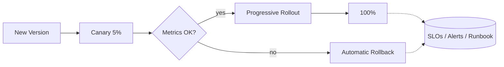

# 🚨 Redline — Agent Platform at Scale

   

> 💡 **The agent that actually has SLOs, a rollback path, and a postmortem — the FDE/SRE proof point.**



---

**AI Expert Core Tracks — Track 6 of 6: AI Engineer Production.** Takes the Sidekick Ops agent from Track 5 and productionizes it — autoscaling, load testing, cost monitoring, canary rollout, SRE-grade observability — built while working through *AI Engineer Production Track: Deploy LLMs & Agents at Scale*. This is the repo that most directly proves DevOps/SRE + Agentic AI combined, and should anchor the portfolio.

## 🧩 Sub-projects
- **`autoscaling-deploy/`** — the agent deployed behind an autoscaling policy (K8s HPA or equivalent), tuned against real load
- **`load-testing/`** — a load-test suite simulating concurrent agent sessions, with a report on latency/error rate under load
- **`cost-monitoring/`** — per-request LLM spend tracked and attributed, with an alert on budget anomalies
- **`canary-rollout/`** — a canary/progressive-rollout pipeline for shipping a new agent version safely

## 🚀 Capstone
The Track 5 agent (or a standalone equivalent) running as a production service: autoscaled, load-tested, cost-monitored, deployed via canary rollout, with a full observability stack (metrics, logs, traces) and an incident runbook for when it breaks.

## ⚡ Quickstart
```bash
git clone <your-fork-url> && cd redline
cp .env.example .env
./scripts/setup.sh
./scripts/dev.sh
```

## 🗺️ Roadmap
- [ ] Agent deployed behind an autoscaler, tuned against measured load
- [ ] Load-test suite + published latency/error-rate report
- [ ] Cost-per-request tracking + budget alert
- [ ] Canary rollout pipeline with automatic rollback on SLO breach
- [ ] Full observability stack (metrics/logs/traces) + incident runbook
- [ ] A documented incident (real or drilled) with a postmortem

## 🎯 SLOs (defined, not aspirational)
- p95 agent response latency under load: define and track in `docs/slo.md`
- error rate ceiling before automatic rollback triggers
- cost-per-1k-requests ceiling before an alert fires

## 📈 At 10x Scale, I'd
Split the agent's LLM calls across a model-router (cheap model for simple requests, strong model only when needed) to control cost growth, move state out of the agent process entirely so any instance can be scaled to zero, and add chaos testing against the MCP tool dependencies to verify the canary rollback actually triggers under real failure.

## 🔍 Originality vs. the Course
The course teaches production/deployment techniques generally; this repo applies every one of them to a single real agent (carried over from Track 5) with defined SLOs, a load-test report, and a documented incident — the closed loop from "agent works" to "agent is operable," which is the actual FDE/SRE skill gap in the market.

## 📄 License
MIT – see `LICENSE`.
